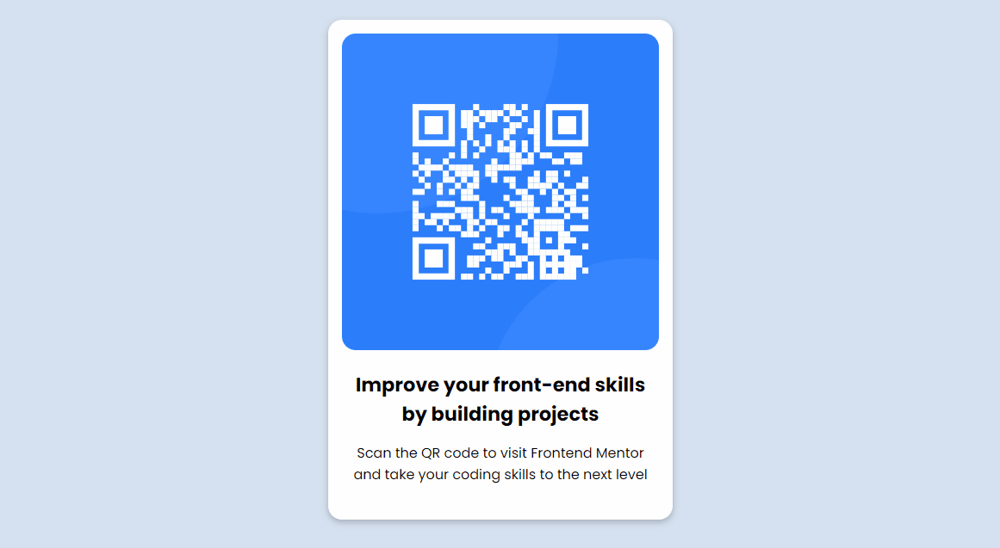

# QR Code Component

## About

This is a simple QR Code Component, a challenge from [Frontend Mentor](https://www.frontendmentor.io).

## Run

Install [Live Server extension](https://marketplace.visualstudio.com/items?itemName=ritwickdey.LiveServer) on your [Visual Studio Code](https://code.visualstudio.com/), right click on `index.html` file and then click on `Open with Live Server`.

## Status

Finished
